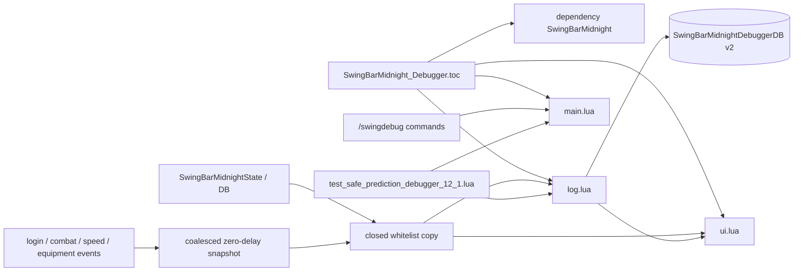

# SwingBarMidnight Prediction Debugger code graph

```mermaid
flowchart LR
  T["SwingBarMidnight_Debugger.toc"] --> D["dependency SwingBarMidnight"]
  T --> L["log.lua"]
  T --> U["ui.lua"]
  T --> M["main.lua"]
  S["SwingBarMidnightState / DB"] --> W["closed whitelist copy"]
  E["login / combat / speed / equipment events"] --> Q["coalesced zero-delay snapshot"]
  Q --> W
  W --> L
  L --> DB[("SwingBarMidnightDebuggerDB v2")]
  W --> U
  L --> U
  C["/swingdebug commands"] --> M
  X["test_safe_prediction_debugger_12_1.lua"] --> L
  X --> M
```

There is no overlay, aura, action-bar, combat-log, actual-hit, frame-tree, or periodic sampling edge.
