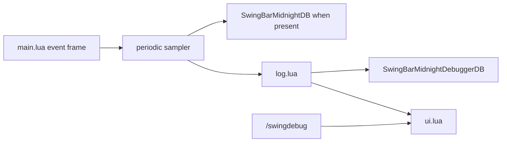

# Code graph

```mermaid
flowchart LR
  Events[main.lua event frame] --> Sampler[periodic sampler]
  Sampler --> MainDB[SwingBarMidnightDB when present]
  Sampler --> Log[log.lua]
  Log --> DebugDB[SwingBarMidnightDebuggerDB]
  Log --> UI[ui.lua]
  Command["/swingdebug"] --> UI
```

`SwingBarMidnightDB` is read conditionally; `SwingBarMidnightDebuggerDB` remains client runtime data and is not committed.
