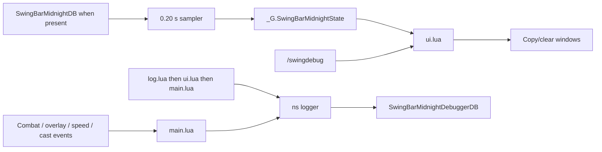

# Code graph

```mermaid
flowchart LR
  TOC[log.lua then ui.lua then main.lua] --> Logger[ns logger]
  Events[Combat / overlay / speed / cast events] --> Main[main.lua]
  Main --> Logger
  Sampler[0.20 s sampler] --> MainState[_G.SwingBarMidnightState]
  MainDB[SwingBarMidnightDB when present] --> Sampler
  MainState --> UI[ui.lua]
  Logger --> DebugDB[SwingBarMidnightDebuggerDB]
  Command["/swingdebug"] --> UI
  UI --> Copy[Copy/clear windows]
```

`SwingBarMidnightDebuggerDB` is client runtime data; it is not a source or release artifact.
